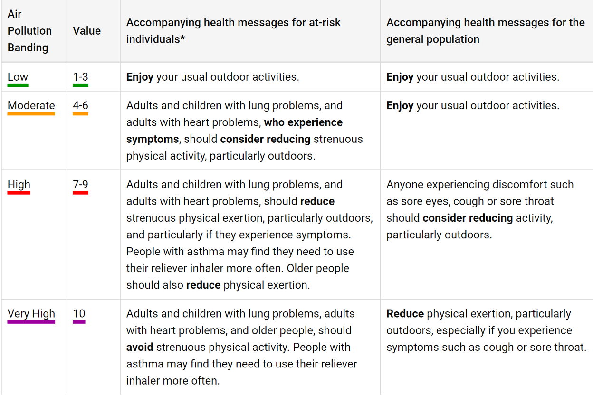

# Pollution AI Predictor
This is a project to develop an AI that will be able
to predict pollution levels based upon a weather forecast from the UK Met Office.

The algorithm to achieve this will be using TensorFlow
which will be trained using observations of pollution and weather. And then displayed on a web interface as follows:

### NOTE: The ML model structure present in this code is not the final one used in the project. This one is significantly more simple, as the final one was written directly on the server that hosted this project.
#### All Other functionality is as executed in the final project.

#### Please also bear in mind that this project was written at a time where my commenting was... lacking, to say the least. There are plans to re-write this project with better coding practises in the future.

[Description of datapoint API](./documentation/datapoint_description.md)

## 2024 Readability Update:
This project is built on the Django structure in Python. 
This is a highly flexible web development structure used internationally for some fairly major projects.
However, due to its nature, this can make it fairly difficult to understand the structure of this project, as someone
with no prior experience. Therefore, I will detail where each aspect of the project can be found below:

- Database Models / Structure: `./smog/models.py`
- Met Office Web API Access: `./smog/business/datapoint/load_datapoint_data.py`
- London Air Quality Web API Access: `./smog/business/datapoint/load_laq_data.py`
- TensorFlow Model Pre-Processing & Training: `./smog/business/tensorflow_building/alternative.py`
- Tensorflow Deployment to Production: `./smog/business/tensorflow_deployment/tensorflow_deploy.py`
- Web Interface Page Structures: `./templates`
- Back-End functionality: `./smog/view.py`, `./smog/views/home.py`
- URL Routing: ALL `urls.py` FILES